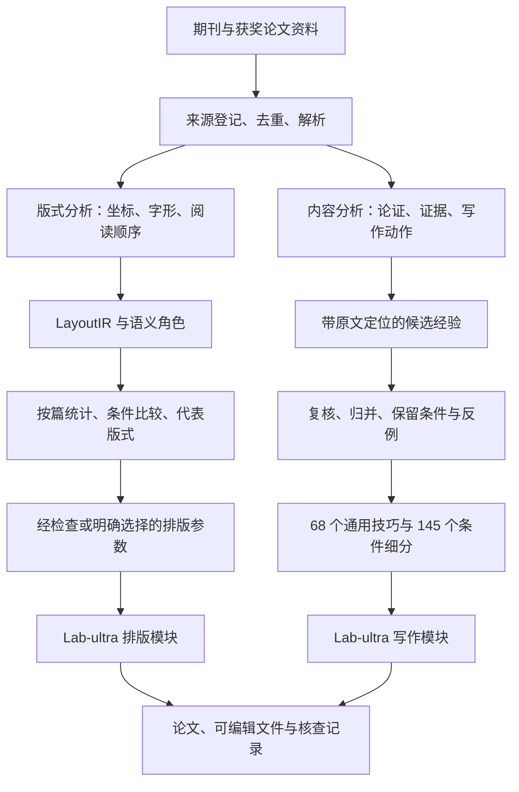

# Lab-ultra-unified 🧪

我把期刊论文的版式分析、获奖论文的论证经验，以及建模、计算、画图、写作和排版工具，整理成了一套可以装进 Agent 的 Skill。项目叫 `lab-ultra-unified`，装好以后用 `$lab-ultra` 调用。

我想解决的毛病很具体：公式突然出现，读者不知道它从哪来；结果摆了半页，正文只说“由图可知”；排版调得挺整齐，图注却跑到了下一页。这套工具会沿着这些问题，追到模型、证据和页面安排上。

目前的统一版包含 **20 个模块、68 个通用写作技巧、145 个条件细分**。下面有蒸馏流程、实际产物，也有一篇可以直接翻的论文。源码附录也带上了，稍微有点厚。

[看设计论文](docs/design-paper/Lab-ultra-unified-整体设计论文.pdf) · [看生成案例](#生成案例药材烘干论文) · [看蒸馏流程](#这些经验是怎么蒸出来的) · [安装使用](#装进你的-agent) · [技术细节与证据](docs/distillation.md)

## 这套 Skill 自己也写了一篇论文

想看看锅底的管线怎么接，可以读这篇 [Lab-ultra-unified 整体设计论文](docs/design-paper/Lab-ultra-unified-整体设计论文.pdf)。21 页，把“怎么蒸、怎么查、怎么用”展开讲：从连续分块和引文校验，到条件技巧归并，再到版式统计、运行时检索和证据更新。药材案例的图与结果也放进去了。

[论文与编译源码](docs/design-paper/README.md) · [从 lab-Pro 改了哪些地方](docs/design-paper/REVISION.md)

## 生成案例：药材烘干论文

《圆柱药材烘干的二维热湿传递建模与收缩一致性分析》

[打开完整 PDF，含源码附录](examples/herbal-drying/paper-with-source.pdf) · [案例说明](examples/herbal-drying/README.md)

<table>
  <tr>
    <td><a href="assets/paper-page-01.png"></a></td>
    <td><a href="assets/paper-page-10.png"></a></td>
    <td><a href="assets/paper-page-14.png"></a></td>
  </tr>
  <tr><td>摘要与结论范围</td><td>从物理对象到离散方法</td><td>结果图与差异解释</td></tr>
</table>

这份 PDF 一共 285 页，后面带了大量源码。适合先翻正文，再按需要看附录；不用一口气把 Python 当小说读完。

这里我想展示的是一篇论文如何展开：从圆柱药材的热湿传递问题出发，说明二维轴对称模型和有限体积离散，再解释温度与含水率为什么表现不同。后文还检查了收缩假设与质量守恒的冲突，并讨论缺少表面平衡参数时，含潜热模型能得出什么结论。

案例由我提供，用于展示生成论文的内容组织、图表和排版。它包含反复建模与修订，不代表这个发行版一次调用的独立测试，也没有获奖或工程验证的含义。

## 这些经验是怎么蒸出来的

项目里的“蒸馏”主要产出结构化数据、条件规则和运行时资源。写作部分没有训练或发布新的大模型权重；版式研究包含统计建模和参数投影。

我把工作分成两条流程。版式这条看页面怎么安排，内容这条看论证怎么展开，最后分别接入排版模块和写作模块。



### 版式蒸馏：把“看着舒服”拆成能检查的数据

我希望借鉴顶刊的信息组织和排版习惯，所以把正文与标题的比例、行距、公式附近的留白、图注的尺度，以及页面信息分布拆开研究。获奖论文还提供了中文数模特有的阅读经验，比如多问如何衔接，几何图怎样靠近推导，结果表怎样接回实际动作。

具体处理从 PDF 解析开始。原生文本保留坐标、字体、字号和基线；扫描件走 OCR，记录文字框与来源。它们进入统一的 `LayoutIR`，再标注标题、定义、公式、图注等结构角色。模型负责判断文字的角色，几何量由解析器和测量代码提供。

接下来分别统计各类内容的版式特征，按论文汇总后再比较。一本特别长的论文不会因为页数多，就在统计里多拿几十张选票。对语义与样式之间的关系，还要控制同一篇论文的模板差异，按论文分组验证，避免把某个出版社的模板误认成普遍规律。

国赛布局校准用到了 64 篇获奖展示稿和 752 个期刊语料身份。在这轮离线分析里，两组总权重设为 0.60 和 0.40，组内按篇等权；代表版式用实际观测到的 medoid，即与同组样本总体距离较小的一篇。0.60 是面向国赛任务的设计选择，另做了权重敏感性和留出检查。

最终可交给排版器的控制项收在有限的 `Style Tokens` 中，并受可读性和排版规则约束。当前默认是作者选定的 `journal-dense-cn-v1`。752 个期刊身份中，来源核验达到 `publisher-final` 的锚点为 21 个；后续 v2.1 研究尚无可导出的新共识因子。这个默认样式的身份和限制都保存在[版式策略说明](skills/lab-ultra-typesetter/references/aesthetic-policy.md)里。

### 内容蒸馏：看看前人到底把哪一步讲明白了

读获奖论文时，我关心的是读者怎样跟上推理。例如，作者如何从现实条件引出约束，为什么选某个局部作图，后问如何接着前问的模型往下走，以及证据不够时怎样收住结论。

每份文本先形成论证地图，再提取具体写作动作。候选经验带着原文行号或块编号、短引文、读者收益和适用限制。程序检查引文是否真的出现在指定区间；遇到长文，就连续分块处理，再汇总和复核。漏掉的公式、缺失的图像和混排的他文会留在问题记录里。

归并时，同一种表达动作可以合到通用技巧下，条件不同的用法单独保留。原文有错、推理过头或只是列了个算法名，都需要具体处置。获奖身份很有参考价值，公式有问题还是得圈出来。

举个库里现成的例子，`variant-0039` 叫“搜索覆盖与停止理由”：

| 字段 | 当前规则 |
| --- | --- |
| `rule` | 报告搜索、枚举或迭代实际覆盖的区域、已有界或可行性证据和停止点，并限定这些证据支持的结论强度。 |
| `conditions` | 答案由有限搜索或迭代得到且覆盖和停止可记录。 |
| `misuse` | 不能把一次稳定或局部搜索写成全域最优。 |

写作时三个字段一起看。假如只做了有限范围搜索，正文就说明范围、停止原因和结果支持到哪一步。“全局最优”四个字省不了证明。

## 蒸完以后，锅里有什么

以下是 2026-09-10 统一版的统计，各行有各自的分母：

| 产物 | 数量 | 口径 |
| --- | ---: | --- |
| 最终文本分析 | 1,585 份 | 已登记的转换文本，包含不同资料角色和版本 |
| 有明确去向的原候选 | 6,230 条 | 6,168 条吸收，62 条按具体理由排除 |
| 额外吸收的补充记录 | 46 条 | 38 条分析字段补充和 8 条历史复盘补充 |
| 通用写作技巧 | 68 个 | 归并后的父类技巧 |
| 条件细分 | 145 个 | 保留具体写法、适用条件与误用提醒 |
| 运行时模块 | 20 个 | 1 个主入口和 19 个同套子模块 |
| Skill 资源 | 265 个文件 | 由发行版 manifest 逐文件记录 |

可直接查看[通用技巧数据](skills/lab-ultra-writing/references/exposition-cards.json)、[条件细分与来源记录](skills/lab-ultra-writing/references/technique-variants.json)和[归并统计](docs/consolidation-summary.json)。喜欢翻底稿的朋友有地方下手。

1,585 份分析来自已经转换的文本批次。原始资料库仍有未转换文件、未解码的归档内容和未转录媒体；这些不会算进完成量。68 个技巧的数量也不等于 68 种方法已经证明能提高论文质量。

发行时，包内和安装后的检查分别通过了 128 项回归。三个固定证据改稿案例检查了“有限搜索写成全局最优”“子样本通过率写成整体准确率”“类比写成机制证明”等问题。这些记录支持相应的功能与措辞检查，尚不足以给出整篇论文质量提升的统计结论。

## 装进你的 Agent

下载本仓库并进入根目录。下面使用与本项目安装记录一致的用户级 Skill 路径；其他客户端请换成自己的 Skill 目录。

```bash
python3 -B install_lab.py install --bundle . --dest "$HOME/.agents/skills"
python3 -B install_lab.py verify --bundle . --dest "$HOME/.agents/skills"
```

安装器会完整安装 20 个模块，并拒绝合并覆盖已有同名目录。更新旧版时，先备份原来的整套 `lab-ultra` 和 `lab-ultra-*`。不要只复制一个主入口，剩下 19 个同事还在门外。

客户端加载这套 Skill 后，可以这样交代任务：

```text
$lab-ultra

请先读题面和附件，说明每问的输入、输出和数据缺口。
从物理对象、变量与守恒关系推导模型，再实现计算。
计算完成后写成论文，解释结果及其限制，并给出可编辑稿和核查记录。
```

已有模型、只想把方法写明白时，范围可以更小：

```text
$lab-ultra-writing

模型和数值已定，请保留已有结论。
帮我检查方法部分哪些推导跳步、哪些符号缺少现实含义，
按需要查询写作技巧，改成读者能跟上的论述。
```

也可以直接在本地查一条规则：

```bash
python3 skills/lab-ultra-writing/scripts/query_variants.py query 搜索 --limit 3
python3 skills/lab-ultra-writing/scripts/query_variants.py show variant-0039
python3 skills/lab-ultra-writing/scripts/query_variants.py health
```

这个查询器做字面匹配，无需联网或原论文库。Agent 再结合当前问题判断是否适用；查不到合适的规则，就正常组织文字。

安装包带有 Skill、脚本和资源。计算、绘图、LaTeX 编译所需的环境，以及可选检索服务的认证，需要在使用相应模块时准备。已有规则的查询不要求重跑蒸馏。

## 技术栈，各有各的活

| 环节 | 技术与产物 | 负责什么 |
| --- | --- | --- |
| PDF 与扫描件解析 | Python、pdfplumber、MinerU OCR、归一化文字框 | 提取文字与版式几何，保留原生和 OCR 来源区别 |
| 版式数据 | Pydantic、LayoutIR、SemanticGraph、JSONL / CSV，可选 Parquet / DuckDB | 校验结构，保存角色、坐标、置信度和来源 |
| 版式研究 | NumPy、pandas、按篇加权、L1 medoid、分组验证 | 统计版式分布，检查模板混杂与稳定性 |
| 内容处理 | 兼容 API 的模型调用、原生 Agent 审读、map / reduce / audit | 生成论证地图、提取和复核写作候选 |
| 长任务管理 | SQLite、并发任务、重试、预算预留、SHA-256 | 记录状态，支持恢复与输入追溯 |
| 写作资源 | JSON 技巧库、Markdown 视图、Python 查询器 | 归并规则，按需读取条件与误用 |
| 排版 | Pandoc AST、Lua Filter、LaTeX / XeLaTeX、Style Tokens | 从定稿 Markdown 生成可编辑 LaTeX 和 PDF |
| 科学绘图 | Matplotlib 与同套图表模块 | 组织数据图、关系图和可编辑图源，核查导出 |

离线蒸馏与运行时使用是两套工作。这个分发目录包含已编译的 20 模块运行时和案例；离线研究的流程、源码位置与证据口径见[蒸馏技术说明](docs/distillation.md)。原始论文库、OCR 全文、账户认证和模型权重没有随运行时打包。

## 模块怎么配合

`lab-ultra` 根据任务范围协调同套子模块。只想润色一段，就处理那一段；需要完整论文时，再连接后面的计算和交付。

| 工作 | 模块 |
| --- | --- |
| 读题与建模 | `lab-ultra-intake`、`lab-ultra-modeling` |
| 计算与审查 | `lab-ultra-compute`、`lab-ultra-review` |
| 参考与文献 | `lab-ultra-references`、`lab-ultra-sciverse` |
| 写作与排版 | `lab-ultra-writing`、`lab-ultra-typesetter` |
| 图表统筹 | `lab-ultra-scientific-figure-maker`、`lab-ultra-scientific-visualization` |
| 数据图与图例 | `lab-ultra-academic-plotting`、`lab-ultra-scipilot-figure-skill`、`lab-ultra-agent-figure-gallery`、`lab-ultra-generate-plot`、`lab-ultra-figure-generation` |
| 结构与关系图 | `lab-ultra-figure-spec`、`lab-ultra-generate-diagram`、`lab-ultra-evaluate-diagram`、`lab-ultra-draw-io` |

排版模块接手时，正文应当已经完成。它保留内容，检查编号、交叉引用、缺图、溢出和编译结果，输出 LaTeX、PDF 及审计文件。数学是否成立、图有没有解释错，仍需要相应的内容审查。

## Contributors：一起搅这口锅的人

| 贡献者 | GitHub |
| --- | --- |
| Tangtaizong-BUAA | [@Tangtaizong-BUAA](https://github.com/Tangtaizong-BUAA) |
| 1923870998-create | [@1923870998-create](https://github.com/1923870998-create) |

两位项目贡献者共同署名。完整名单见 [CONTRIBUTORS.md](CONTRIBUTORS.md)。

## 一起改点有用的

欢迎带具体材料来提 Issue：哪条规则不适用、哪一段被改得更难懂、哪一页发生了断页问题。写作规则最好附最小案例与预期表达；排版问题请带复现稿和相关资源。遇到反例也欢迎发，技巧库需要知道自己什么时候该闭嘴。

模块中的第三方来源记录和许可证文件随各自资源保留。本目录暂未指定仓库级许可证；生成案例的使用范围也需单独说明。
