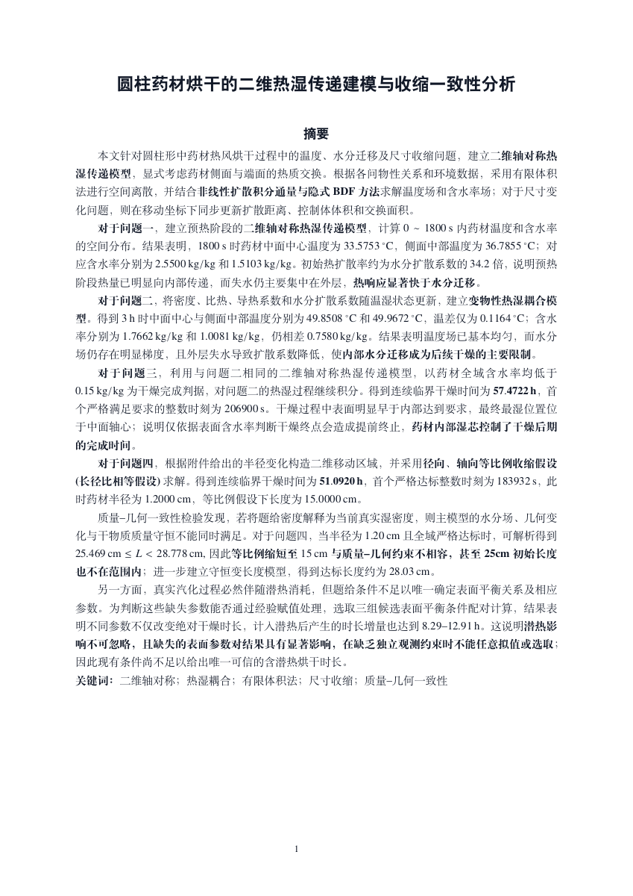
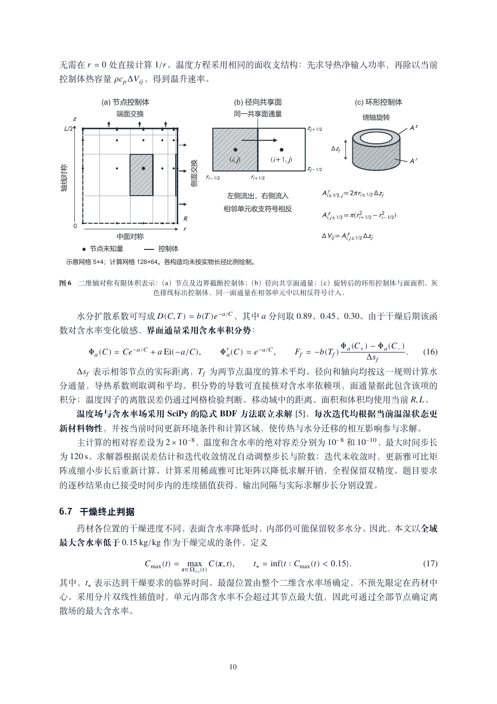
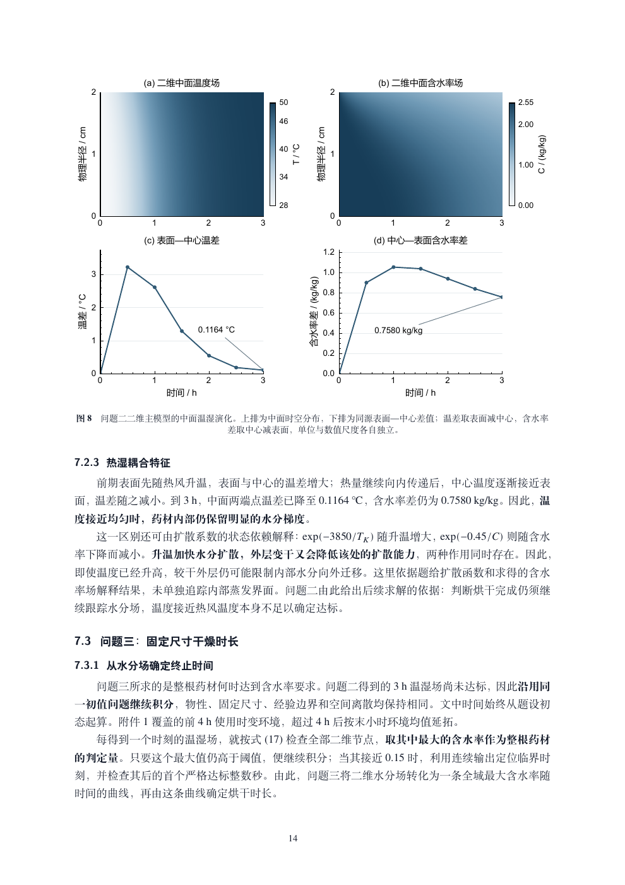
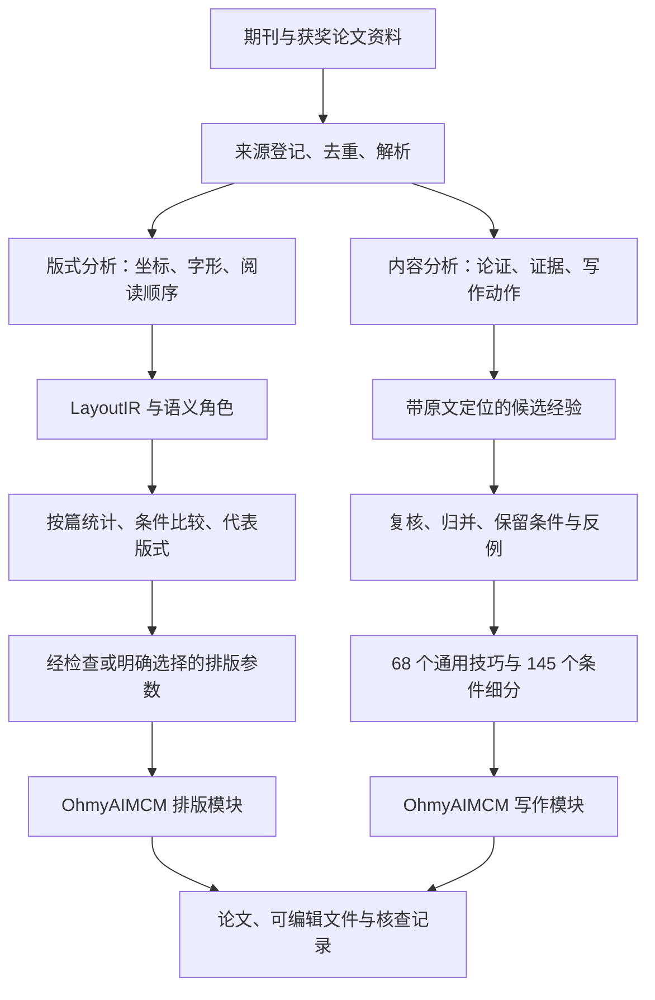

# OhmyAIMCM：面向科学探究的 Scientific Agentic OS

以全国大学生数学建模竞赛为首个应用场景，探索如何通过系统架构释放模型的科学推理能力。

我们希望回答的问题是：在模型能力快速迭代的今天，怎样组织科研信息、工具和任务状态，才能让模型更充分地开展科学探究，并将探索过程转化为有证据支持、可以复核的研究成果？

OhmyAIMCM 的长期目标是构建一套 Scientific Agentic OS，为科研 Agent 提供持续工作的组织结构。模型负责提出假设、选择方法、设计实验和解释结果；系统负责组织证据及其依赖关系、接入计算与表达工具，并在成果流转时检查版本、语义和交付条件。我们把架构设计的重点放在模型能力如何被调用、扩展和检验上。

这里的 OS 指运行于宿主 Agent 之上的科研任务组织与执行层。当前实现以 Agent Skills、结构化资源和可执行脚本组成，使用宿主提供的工具及原生协作能力。CUMCM 同时涉及问题理解、数学推导、数值计算和论文交付，因此被选作检验这套架构的首个完整场景；向更广泛科研任务的推广是项目的后续方向。

架构遵循一个原则：保留模型在科学探索中的方法选择权，同时明确研究成果成为正式证据的条件。模型可以修订假设、交替开展建模与计算，也可以让图表揭示对原结论不利的结果。计算值需要实际运行记录，论断需要对应来源，图形需要保持科学含义，排版需要保留已经审查的内容。约束集中于证据使用和成果流转，使模型能够在明确的任务范围内持续探索。

我们已将这套方法用于多轮论文构建，观察到符合预期的成果，这些实践推动了当前架构的形成。项目希望进一步检验：在相同模型、材料、工具权限和预算下，这套系统能否比不加载 Skill 的运行方式更好地完成科研任务。当前公开的案例和局部回归提供了可检查的实现与成果，系统性的能力增益仍需通过对照评测量化。

当前统一版包含 20 个模块、68 个通用写作技巧和 145 个条件细分。项目与调用入口统一命名为 `OhmyAIMCM`，主入口为 `$OhmyAIMCM`，子模块使用 `OhmyAIMCM-*`。本仓库提供运行时资源、蒸馏方法、系统设计论文，以及附完整源码的药材烘干论文案例。

[设计论文](docs/design-paper/OhmyAIMCM-整体设计论文.pdf) · [论文案例](#生成案例药材烘干论文) · [蒸馏方法](#这些经验是怎么蒸出来的) · [安装使用](#装进你的-agent) · [技术细节与证据](docs/distillation.md)

## 架构设计：如何支持更强的科研 Agent

系统围绕科研信息、推理与成果之间的关系组织工作。以下机制分别处理长任务中容易丢失的上下文、不同工具之间的语义交接，以及研究结果修改后的同步检查。

| 架构系统 | 实现机制 | 对模型工作的作用 |
| --- | --- | --- |
| 科研信息图处理 | 区分论文解析中的 `LayoutIR` / `SemanticGraph` 与任务运行中的证据关系图；后者记录事实、假设、结果、图表、正文和审查之间的依赖及限制条件 | 按当前问题读取相关证据，并在结果修订后定位需要重新检查的下游内容 |
| 科学图形系统 | 通过 `FigureRequest`、`DataProfile`、`FigureIR` 表达作图目的、数据语义、视觉编码和来源，按需选择数据图、关系图或三维物理场景 | 让模型利用图形解释结构、比较结果和发现矛盾；数值、几何和单位等科学不变量由对应来源与检查约束 |
| 内容保真的排版系统 | 将定稿 Markdown 经 Pandoc AST、Lua Filter 和 LaTeX 转换为论文；用 `Style Tokens` 管理版式，用内容锁和审计记录检查转换 | 将版面处理交给可执行工具，保留模型在论证和表达上的判断，并检查排版后的内容一致性 |
| 条件化知识与按需上下文 | 从论文中提取带来源、适用条件和误用限制的技巧；按具体知识缺口检索资源、加载子模块 | 让已有研究经验参与当前推理，避免把全部语料和固定算法菜单放进每次任务 |
| 版本明确的协作与修订 | 主代理维护整体答案，写作角色整合正文；独立任务按需交给宿主原生 Agent，交接指定产物、版本和写入范围 | 支持专门化工作与整篇论证的整合，修订后回查受影响的计算、图注、摘要和审查记录 |

例如，某次计算修正了一个参数，变化可能同时影响结果表、曲线、正文解释和摘要。证据关系图的 `impact` 可以沿已声明的依赖关系列出受影响对象；主代理据此安排重算、改稿和复核。`select` 则返回目标所依赖的来源定位，并携带相关限制和反面证据。工具处理依赖和版本，模型与审查者判断证据是否支持论断。

图形和排版也采用同样的分工：模型可以选择更合适的表达方式，数据图中的数值由确定性代码生成；图形完成后按最终使用尺寸检查；排版器在保留内容的条件下处理页面组成。如果新图揭示了原论断的问题，修改应回到论证环节，并更新其下游使用。

这些机制构成项目的架构设计贡献。实现范围、信息图之间的区别、约束的执行方式，以及拟议的同模型对照与消融评测，见 [Scientific Agentic OS 架构说明](docs/scientific-agentic-os.md)。

## 系统设计论文

[OhmyAIMCM 整体设计论文](docs/design-paper/OhmyAIMCM-整体设计论文.pdf)共 21 页，详细说明内容蒸馏中的连续分块、引文校验与条件技巧归并，以及版式统计、运行时检索和证据更新机制。文中包含技术栈、数据结构、验证范围及药材论文的图表与结果分析。

[论文与编译源码](docs/design-paper/README.md) · [版本修订说明](docs/design-paper/REVISION.md)

## 生成案例：药材烘干论文

《圆柱药材烘干的二维热湿传递建模与收缩一致性分析》

[打开完整 PDF，含源码附录](examples/herbal-drying/paper-with-source.pdf) · [案例说明](examples/herbal-drying/README.md)

<table>
  <tr>
    <td><a href="assets/paper-page-01.png"></a></td>
    <td><a href="assets/paper-page-10.png"></a></td>
    <td><a href="assets/paper-page-14.png"></a></td>
  </tr>
  <tr><td>摘要与结论范围</td><td>从物理对象到离散方法</td><td>结果图与差异解释</td></tr>
</table>

案例 PDF 共 285 页，包含论文正文与完整源码附录。正文用于查阅模型推导和结果分析，源码附录用于核查计算实现。

论文从圆柱药材的热湿传递问题出发，建立二维轴对称模型并采用有限体积法离散，分析温度与含水率的变化及其差异。后续章节检查收缩假设与质量守恒之间的一致性，并讨论表面平衡参数缺失时含潜热模型的结论范围。

案例由项目作者提供，用于展示论文的内容组织、图表及排版结果。该案例经历了多轮建模与修订，不属于当前发行版单次调用的独立测试，也不构成获奖记录或工程验证。

<a id="这些经验是怎么蒸出来的"></a>

## 论文蒸馏方法

本项目中的“蒸馏”指从论文资料中提取、复核并归并可复用的信息，主要产物为结构化数据、条件规则与运行时资源。写作部分未训练或发布新的大模型权重；版式研究包含统计建模与参数投影。

蒸馏过程分为版式与内容两条路线。版式路线分析页面布局及内容的视觉组织，内容路线提取模型解释与论证展开的方法，两类产物分别接入排版模块和写作模块。



### 版式蒸馏：几何特征提取与布局校准

版式研究参考高水平期刊的信息组织与排版方式，分别分析正文与标题的比例、行距、公式周围留白、图注尺度及页面信息分布。获奖国赛论文用于补充中文数模论文的布局特征，包括多问之间的衔接、几何图与推导的位置关系，以及结果表与问题解释的对应关系。

处理流程首先解析 PDF。原生文本保留坐标、字体、字号和基线；扫描件通过 OCR 提取文字，并记录文字框与来源。解析结果进入统一的 `LayoutIR`，随后标注标题、定义、公式、图注等结构角色。模型用于识别内容角色，几何量由解析器和测量代码提供。

各类内容的版式特征按论文汇总后进行比较，以控制篇幅差异对统计权重的影响。语义与样式关系的分析还需控制论文模板的影响，并按论文分组验证，区分出版社模板特征与可迁移的布局规律。

国赛布局校准使用 64 篇获奖展示稿和 752 个期刊语料身份。在该轮离线分析中，两组总权重分别设为 0.60 和 0.40，组内按篇等权；代表版式采用实际观测样本中的 medoid，即与同组样本总体距离较小的代表样本。权重 0.60 为面向国赛任务的设计选择，相关记录包含权重敏感性与留出检查。

排版器使用的控制项由有限的 `Style Tokens` 表示，并受可读性与排版规则约束。当前默认样式为作者选定的 `journal-dense-cn-v1`。752 个期刊身份中，来源核验达到 `publisher-final` 的锚点为 21 个；后续 v2.1 研究尚无可导出的新共识因子。默认样式的来源和适用限制见[版式策略说明](skills/OhmyAIMCM-typesetter/references/aesthetic-policy.md)。

### 内容蒸馏：论证动作提取与条件规则归并

内容蒸馏关注获奖国赛论文中支持读者理解推理的具体写法，包括从现实条件引出约束、说明局部作图的选择依据、衔接不同问题的模型，以及根据证据范围限定结论。

每份文本首先形成论证地图，再提取具体写作动作。候选记录包含原文行号或块编号、短引文、读者收益和适用限制。程序校验引文是否出现在指定区间；长文本采用连续分块处理，随后汇总与复核。公式遗漏、图像缺失及其他论文内容混入等情况单独记录。

归并过程将相同表达动作归入通用技巧，并保留适用条件不同的细分规则。对原文错误、过度推断或仅列举算法名称的内容，分别记录处置依据。获奖身份用于来源筛选，原文中的公式与推理仍需复核。

以条件细分 `variant-0039`“搜索覆盖与停止理由”为例，其规则包含以下字段：

| 字段 | 当前规则 |
| --- | --- |
| `rule` | 报告搜索、枚举或迭代实际覆盖的区域、已有界或可行性证据和停止点，并限定这些证据支持的结论强度。 |
| `conditions` | 答案由有限搜索或迭代得到且覆盖和停止可记录。 |
| `misuse` | 不能把一次稳定或局部搜索写成全域最优。 |

使用该规则时，应同时考虑具体写法、适用条件与误用限制。对于有限范围搜索，正文需报告搜索范围、停止依据和结论强度；全局最优性结论需要相应证明。

## 蒸馏产物与验证结果

2026-09-10 统一版的产物统计如下。各项数量按表中口径计算：

| 产物 | 数量 | 口径 |
| --- | ---: | --- |
| 最终文本分析 | 1,585 份 | 已登记的转换文本，包含不同资料角色和版本 |
| 有明确去向的原候选 | 6,230 条 | 6,168 条吸收，62 条按具体理由排除 |
| 额外吸收的补充记录 | 46 条 | 38 条分析字段补充和 8 条历史复盘补充 |
| 通用写作技巧 | 68 个 | 归并后的父类技巧 |
| 条件细分 | 145 个 | 保留具体写法、适用条件与误用提醒 |
| 运行时模块 | 20 个 | 1 个主入口和 19 个同套子模块 |
| Skill 资源 | 265 个文件 | 由发行版 manifest 逐文件记录 |

可直接查看[通用技巧数据](skills/OhmyAIMCM-writing/references/exposition-cards.json)、[条件细分与来源记录](skills/OhmyAIMCM-writing/references/technique-variants.json)和[归并统计](docs/consolidation-summary.json)。

1,585 份分析对应已转换的文本批次。原始资料库中的未转换文件、未解码归档内容及未转录媒体不计入完成量。68 个通用技巧为资源归并结果，其数量不代表已经验证的论文质量改进方法数量。

发行时，包内和安装后的检查分别通过了 128 项回归。三个固定证据改稿案例检查了“有限搜索写成全局最优”“子样本通过率写成整体准确率”“类比写成机制证明”等问题。这些记录支持相应的功能与措辞检查，尚不足以给出整篇论文质量提升的统计结论。

<a id="装进你的-agent"></a>

## 安装与使用

下载本仓库并进入根目录。以下命令使用项目安装记录中的用户级 Skill 路径；使用其他客户端时，应将目标路径替换为对应的 Skill 目录。

```bash
python3 -B install.py install --bundle . --dest "$HOME/.agents/skills"
python3 -B install.py verify --bundle . --dest "$HOME/.agents/skills"
```

安装器完整安装 20 个模块，并拒绝合并覆盖已有同名目录。更新前应备份现有的整套 `OhmyAIMCM` 和 `OhmyAIMCM-*`。主入口依赖同套子模块，安装时需保留完整模块集合。

客户端加载 Skill 后，可使用以下任务指令：

```text
$OhmyAIMCM

请先读题面和附件，说明每问的输入、输出和数据缺口。
从物理对象、变量与守恒关系推导模型，再实现计算。
计算完成后写成论文，解释结果及其限制，并给出可编辑稿和核查记录。
```

对于已有模型与计算结果的任务，可单独调用写作模块：

```text
$OhmyAIMCM-writing

模型和数值已定，请保留已有结论。
帮我检查方法部分哪些推导跳步、哪些符号缺少现实含义，
按需要查询写作技巧，改成读者能跟上的论述。
```

条件规则支持通过本地命令查询：

```bash
python3 skills/OhmyAIMCM-writing/scripts/query_variants.py query 搜索 --limit 3
python3 skills/OhmyAIMCM-writing/scripts/query_variants.py show variant-0039
python3 skills/OhmyAIMCM-writing/scripts/query_variants.py health
```

查询器采用字面匹配，无需联网或访问原始论文库。Agent 根据当前任务判断检索结果的适用性；未检索到合适规则时，依据任务材料组织论述。

安装包包含 Skill、脚本及运行时资源。计算、绘图和 LaTeX 编译依赖相应环境，可选检索服务还需配置认证。查询已有规则无需重新执行蒸馏流程。

## 技术栈与组件职责

| 环节 | 技术与产物 | 组件职责 |
| --- | --- | --- |
| PDF 与扫描件解析 | Python、pdfplumber、MinerU OCR、归一化文字框 | 提取文字与版式几何，保留原生和 OCR 来源区别 |
| 版式数据 | Pydantic、LayoutIR、SemanticGraph、JSONL / CSV，可选 Parquet / DuckDB | 校验结构，保存角色、坐标、置信度和来源 |
| 版式研究 | NumPy、pandas、按篇加权、L1 medoid、分组验证 | 统计版式分布，检查模板混杂与稳定性 |
| 内容处理 | 兼容 API 的模型调用、原生 Agent 审读、map / reduce / audit | 生成论证地图、提取和复核写作候选 |
| 长任务管理 | SQLite、并发任务、重试、预算预留、SHA-256 | 记录状态，支持恢复与输入追溯 |
| 写作资源 | JSON 技巧库、Markdown 视图、Python 查询器 | 归并规则，按需读取条件与误用 |
| 排版 | Pandoc AST、Lua Filter、LaTeX / XeLaTeX、Style Tokens | 从定稿 Markdown 生成可编辑 LaTeX 和 PDF |
| 科学绘图 | Matplotlib 与同套图表模块 | 组织数据图、关系图和可编辑图源，核查导出 |

离线蒸馏负责构建资源，运行时模块负责在具体任务中使用这些资源。本分发目录包含已编译的 20 模块运行时与论文案例；离线研究流程、源码位置及证据口径见[蒸馏技术说明](docs/distillation.md)。运行时分发不包含原始论文库、OCR 全文、账户认证或模型权重。

## 模块结构与协作流程

`OhmyAIMCM` 根据任务范围协调同套子模块。局部写作任务按指定段落处理；完整国赛论文任务按需要组织读题、建模、计算、写作、审查及交付。

| 工作 | 模块 |
| --- | --- |
| 读题与建模 | `OhmyAIMCM-intake`、`OhmyAIMCM-modeling` |
| 计算与审查 | `OhmyAIMCM-compute`、`OhmyAIMCM-review` |
| 参考与文献 | `OhmyAIMCM-references`、`OhmyAIMCM-sciverse` |
| 写作与排版 | `OhmyAIMCM-writing`、`OhmyAIMCM-typesetter` |
| 图表统筹 | `OhmyAIMCM-scientific-figure-maker`、`OhmyAIMCM-scientific-visualization` |
| 数据图与图例 | `OhmyAIMCM-academic-plotting`、`OhmyAIMCM-scipilot-figure-skill`、`OhmyAIMCM-agent-figure-gallery`、`OhmyAIMCM-generate-plot`、`OhmyAIMCM-figure-generation` |
| 结构与关系图 | `OhmyAIMCM-figure-spec`、`OhmyAIMCM-generate-diagram`、`OhmyAIMCM-evaluate-diagram`、`OhmyAIMCM-draw-io` |

排版模块以已完成的正文为输入，保留原有内容，检查编号、交叉引用、图像缺失、页面溢出及编译结果，输出 LaTeX、PDF 和审计文件。模型推导、计算结论及图表解释的正确性由相应的内容审查环节核验。

## 贡献者

| 贡献者 | GitHub |
| --- | --- |
| Tangtaizong-BUAA | [@Tangtaizong-BUAA](https://github.com/Tangtaizong-BUAA) |
| 1923870998-create | [@1923870998-create](https://github.com/1923870998-create) |

两位项目贡献者共同署名。完整名单见 [CONTRIBUTORS.md](CONTRIBUTORS.md)。

## 问题反馈与贡献说明

问题反馈可通过 Issue 提交，说明规则适用性、文本修改效果或页面排版中的具体问题。写作规则反馈应附最小案例与预期表达；排版问题应附复现稿和相关资源。反例及适用边界的补充可用于后续规则修订。

模块中的第三方来源记录和许可证文件随各自资源保留。本目录暂未指定仓库级许可证；生成案例的使用范围也需单独说明。
