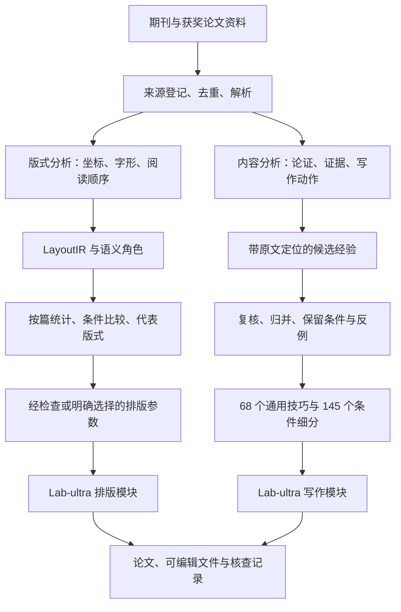

# OhmyAIMCM：全国大学生数学建模竞赛论文 Skill

OhmyAIMCM 是面向全国大学生数学建模竞赛（国赛）论文建模、撰写与排版的 Agent Skill。项目将期刊论文的版式分析与获奖国赛论文的论证经验转化为结构化资源，并与读题、建模、计算、科学绘图、写作和审查模块结合。项目现名为 `OhmyAIMCM`，原名为 `lab-ultra-unified`；当前发行资源的调用入口仍为 `$lab-ultra`。

本项目针对国赛论文中的模型推导跳步、符号含义不清、结果解释不足及图文排版不一致等问题，组织从题目条件、模型假设和计算证据到正文论证的工作流程，并检查论文内容与图表、引用及版面之间的一致性。

当前统一版包含 20 个模块、68 个通用写作技巧和 145 个条件细分。本仓库提供蒸馏方法说明、运行时资源、系统设计论文，以及附完整源码的药材烘干论文案例。

[设计论文](docs/design-paper/Lab-ultra-unified-整体设计论文.pdf) · [论文案例](#生成案例药材烘干论文) · [蒸馏方法](#这些经验是怎么蒸出来的) · [安装使用](#装进你的-agent) · [技术细节与证据](docs/distillation.md)

## 系统设计论文

随附设计论文使用修订时的项目名称 Lab-ultra-unified，所述系统对应当前 OhmyAIMCM 项目。

[Lab-ultra-unified 整体设计论文](docs/design-paper/Lab-ultra-unified-整体设计论文.pdf)共 21 页，详细说明内容蒸馏中的连续分块、引文校验与条件技巧归并，以及版式统计、运行时检索和证据更新机制。文中包含技术栈、数据结构、验证范围及药材论文的图表与结果分析。

[论文与编译源码](docs/design-paper/README.md) · [版本修订说明](docs/design-paper/REVISION.md)

## 生成案例：药材烘干论文

《圆柱药材烘干的二维热湿传递建模与收缩一致性分析》

[打开完整 PDF，含源码附录](examples/herbal-drying/paper-with-source.pdf) · [案例说明](examples/herbal-drying/README.md)

<table>
  <tr>
    <td><a href="assets/paper-page-01.png"></a></td>
    <td><a href="assets/paper-page-10.png"></a></td>
    <td><a href="assets/paper-page-14.png"></a></td>
  </tr>
  <tr><td>摘要与结论范围</td><td>从物理对象到离散方法</td><td>结果图与差异解释</td></tr>
</table>

案例 PDF 共 285 页，包含论文正文与完整源码附录。正文用于查阅模型推导和结果分析，源码附录用于核查计算实现。

论文从圆柱药材的热湿传递问题出发，建立二维轴对称模型并采用有限体积法离散，分析温度与含水率的变化及其差异。后续章节检查收缩假设与质量守恒之间的一致性，并讨论表面平衡参数缺失时含潜热模型的结论范围。

案例由项目作者提供，用于展示论文的内容组织、图表及排版结果。该案例经历了多轮建模与修订，不属于当前发行版单次调用的独立测试，也不构成获奖记录或工程验证。

<a id="这些经验是怎么蒸出来的"></a>

## 论文蒸馏方法

本项目中的“蒸馏”指从论文资料中提取、复核并归并可复用的信息，主要产物为结构化数据、条件规则与运行时资源。写作部分未训练或发布新的大模型权重；版式研究包含统计建模与参数投影。

蒸馏过程分为版式与内容两条路线。版式路线分析页面布局及内容的视觉组织，内容路线提取模型解释与论证展开的方法，两类产物分别接入排版模块和写作模块。



### 版式蒸馏：几何特征提取与布局校准

版式研究参考高水平期刊的信息组织与排版方式，分别分析正文与标题的比例、行距、公式周围留白、图注尺度及页面信息分布。获奖国赛论文用于补充中文数模论文的布局特征，包括多问之间的衔接、几何图与推导的位置关系，以及结果表与问题解释的对应关系。

处理流程首先解析 PDF。原生文本保留坐标、字体、字号和基线；扫描件通过 OCR 提取文字，并记录文字框与来源。解析结果进入统一的 `LayoutIR`，随后标注标题、定义、公式、图注等结构角色。模型用于识别内容角色，几何量由解析器和测量代码提供。

各类内容的版式特征按论文汇总后进行比较，以控制篇幅差异对统计权重的影响。语义与样式关系的分析还需控制论文模板的影响，并按论文分组验证，区分出版社模板特征与可迁移的布局规律。

国赛布局校准使用 64 篇获奖展示稿和 752 个期刊语料身份。在该轮离线分析中，两组总权重分别设为 0.60 和 0.40，组内按篇等权；代表版式采用实际观测样本中的 medoid，即与同组样本总体距离较小的代表样本。权重 0.60 为面向国赛任务的设计选择，相关记录包含权重敏感性与留出检查。

排版器使用的控制项由有限的 `Style Tokens` 表示，并受可读性与排版规则约束。当前默认样式为作者选定的 `journal-dense-cn-v1`。752 个期刊身份中，来源核验达到 `publisher-final` 的锚点为 21 个；后续 v2.1 研究尚无可导出的新共识因子。默认样式的来源和适用限制见[版式策略说明](skills/lab-ultra-typesetter/references/aesthetic-policy.md)。

### 内容蒸馏：论证动作提取与条件规则归并

内容蒸馏关注获奖国赛论文中支持读者理解推理的具体写法，包括从现实条件引出约束、说明局部作图的选择依据、衔接不同问题的模型，以及根据证据范围限定结论。

每份文本首先形成论证地图，再提取具体写作动作。候选记录包含原文行号或块编号、短引文、读者收益和适用限制。程序校验引文是否出现在指定区间；长文本采用连续分块处理，随后汇总与复核。公式遗漏、图像缺失及其他论文内容混入等情况单独记录。

归并过程将相同表达动作归入通用技巧，并保留适用条件不同的细分规则。对原文错误、过度推断或仅列举算法名称的内容，分别记录处置依据。获奖身份用于来源筛选，原文中的公式与推理仍需复核。

以条件细分 `variant-0039`“搜索覆盖与停止理由”为例，其规则包含以下字段：

| 字段 | 当前规则 |
| --- | --- |
| `rule` | 报告搜索、枚举或迭代实际覆盖的区域、已有界或可行性证据和停止点，并限定这些证据支持的结论强度。 |
| `conditions` | 答案由有限搜索或迭代得到且覆盖和停止可记录。 |
| `misuse` | 不能把一次稳定或局部搜索写成全域最优。 |

使用该规则时，应同时考虑具体写法、适用条件与误用限制。对于有限范围搜索，正文需报告搜索范围、停止依据和结论强度；全局最优性结论需要相应证明。

## 蒸馏产物与验证结果

2026-09-10 统一版的产物统计如下。各项数量按表中口径计算：

| 产物 | 数量 | 口径 |
| --- | ---: | --- |
| 最终文本分析 | 1,585 份 | 已登记的转换文本，包含不同资料角色和版本 |
| 有明确去向的原候选 | 6,230 条 | 6,168 条吸收，62 条按具体理由排除 |
| 额外吸收的补充记录 | 46 条 | 38 条分析字段补充和 8 条历史复盘补充 |
| 通用写作技巧 | 68 个 | 归并后的父类技巧 |
| 条件细分 | 145 个 | 保留具体写法、适用条件与误用提醒 |
| 运行时模块 | 20 个 | 1 个主入口和 19 个同套子模块 |
| Skill 资源 | 265 个文件 | 由发行版 manifest 逐文件记录 |

可直接查看[通用技巧数据](skills/lab-ultra-writing/references/exposition-cards.json)、[条件细分与来源记录](skills/lab-ultra-writing/references/technique-variants.json)和[归并统计](docs/consolidation-summary.json)。

1,585 份分析对应已转换的文本批次。原始资料库中的未转换文件、未解码归档内容及未转录媒体不计入完成量。68 个通用技巧为资源归并结果，其数量不代表已经验证的论文质量改进方法数量。

发行时，包内和安装后的检查分别通过了 128 项回归。三个固定证据改稿案例检查了“有限搜索写成全局最优”“子样本通过率写成整体准确率”“类比写成机制证明”等问题。这些记录支持相应的功能与措辞检查，尚不足以给出整篇论文质量提升的统计结论。

<a id="装进你的-agent"></a>

## 安装与使用

下载本仓库并进入根目录。以下命令使用项目安装记录中的用户级 Skill 路径；使用其他客户端时，应将目标路径替换为对应的 Skill 目录。

```bash
python3 -B install_lab.py install --bundle . --dest "$HOME/.agents/skills"
python3 -B install_lab.py verify --bundle . --dest "$HOME/.agents/skills"
```

安装器完整安装 20 个模块，并拒绝合并覆盖已有同名目录。更新前应备份现有的整套 `lab-ultra` 和 `lab-ultra-*`。主入口依赖同套子模块，安装时需保留完整模块集合。

客户端加载 Skill 后，可使用以下任务指令：

```text
$lab-ultra

请先读题面和附件，说明每问的输入、输出和数据缺口。
从物理对象、变量与守恒关系推导模型，再实现计算。
计算完成后写成论文，解释结果及其限制，并给出可编辑稿和核查记录。
```

对于已有模型与计算结果的任务，可单独调用写作模块：

```text
$lab-ultra-writing

模型和数值已定，请保留已有结论。
帮我检查方法部分哪些推导跳步、哪些符号缺少现实含义，
按需要查询写作技巧，改成读者能跟上的论述。
```

条件规则支持通过本地命令查询：

```bash
python3 skills/lab-ultra-writing/scripts/query_variants.py query 搜索 --limit 3
python3 skills/lab-ultra-writing/scripts/query_variants.py show variant-0039
python3 skills/lab-ultra-writing/scripts/query_variants.py health
```

查询器采用字面匹配，无需联网或访问原始论文库。Agent 根据当前任务判断检索结果的适用性；未检索到合适规则时，依据任务材料组织论述。

安装包包含 Skill、脚本及运行时资源。计算、绘图和 LaTeX 编译依赖相应环境，可选检索服务还需配置认证。查询已有规则无需重新执行蒸馏流程。

## 技术栈与组件职责

| 环节 | 技术与产物 | 组件职责 |
| --- | --- | --- |
| PDF 与扫描件解析 | Python、pdfplumber、MinerU OCR、归一化文字框 | 提取文字与版式几何，保留原生和 OCR 来源区别 |
| 版式数据 | Pydantic、LayoutIR、SemanticGraph、JSONL / CSV，可选 Parquet / DuckDB | 校验结构，保存角色、坐标、置信度和来源 |
| 版式研究 | NumPy、pandas、按篇加权、L1 medoid、分组验证 | 统计版式分布，检查模板混杂与稳定性 |
| 内容处理 | 兼容 API 的模型调用、原生 Agent 审读、map / reduce / audit | 生成论证地图、提取和复核写作候选 |
| 长任务管理 | SQLite、并发任务、重试、预算预留、SHA-256 | 记录状态，支持恢复与输入追溯 |
| 写作资源 | JSON 技巧库、Markdown 视图、Python 查询器 | 归并规则，按需读取条件与误用 |
| 排版 | Pandoc AST、Lua Filter、LaTeX / XeLaTeX、Style Tokens | 从定稿 Markdown 生成可编辑 LaTeX 和 PDF |
| 科学绘图 | Matplotlib 与同套图表模块 | 组织数据图、关系图和可编辑图源，核查导出 |

离线蒸馏负责构建资源，运行时模块负责在具体任务中使用这些资源。本分发目录包含已编译的 20 模块运行时与论文案例；离线研究流程、源码位置及证据口径见[蒸馏技术说明](docs/distillation.md)。运行时分发不包含原始论文库、OCR 全文、账户认证或模型权重。

## 模块结构与协作流程

`lab-ultra` 根据任务范围协调同套子模块。局部写作任务按指定段落处理；完整国赛论文任务按需要组织读题、建模、计算、写作、审查及交付。

| 工作 | 模块 |
| --- | --- |
| 读题与建模 | `lab-ultra-intake`、`lab-ultra-modeling` |
| 计算与审查 | `lab-ultra-compute`、`lab-ultra-review` |
| 参考与文献 | `lab-ultra-references`、`lab-ultra-sciverse` |
| 写作与排版 | `lab-ultra-writing`、`lab-ultra-typesetter` |
| 图表统筹 | `lab-ultra-scientific-figure-maker`、`lab-ultra-scientific-visualization` |
| 数据图与图例 | `lab-ultra-academic-plotting`、`lab-ultra-scipilot-figure-skill`、`lab-ultra-agent-figure-gallery`、`lab-ultra-generate-plot`、`lab-ultra-figure-generation` |
| 结构与关系图 | `lab-ultra-figure-spec`、`lab-ultra-generate-diagram`、`lab-ultra-evaluate-diagram`、`lab-ultra-draw-io` |

排版模块以已完成的正文为输入，保留原有内容，检查编号、交叉引用、图像缺失、页面溢出及编译结果，输出 LaTeX、PDF 和审计文件。模型推导、计算结论及图表解释的正确性由相应的内容审查环节核验。

## 贡献者

| 贡献者 | GitHub |
| --- | --- |
| Tangtaizong-BUAA | [@Tangtaizong-BUAA](https://github.com/Tangtaizong-BUAA) |
| 1923870998-create | [@1923870998-create](https://github.com/1923870998-create) |

两位项目贡献者共同署名。完整名单见 [CONTRIBUTORS.md](CONTRIBUTORS.md)。

## 问题反馈与贡献说明

问题反馈可通过 Issue 提交，说明规则适用性、文本修改效果或页面排版中的具体问题。写作规则反馈应附最小案例与预期表达；排版问题应附复现稿和相关资源。反例及适用边界的补充可用于后续规则修订。

模块中的第三方来源记录和许可证文件随各自资源保留。本目录暂未指定仓库级许可证；生成案例的使用范围也需单独说明。
