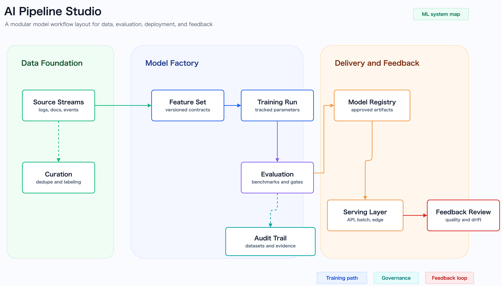
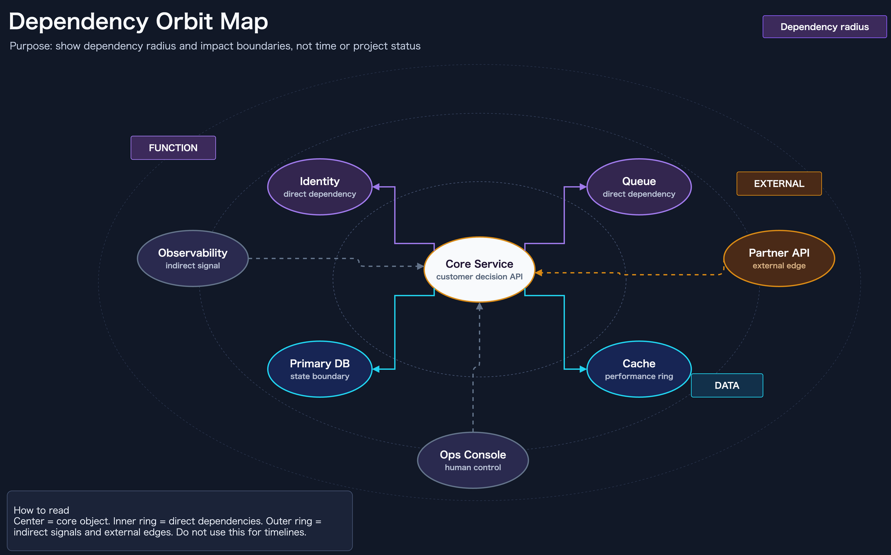
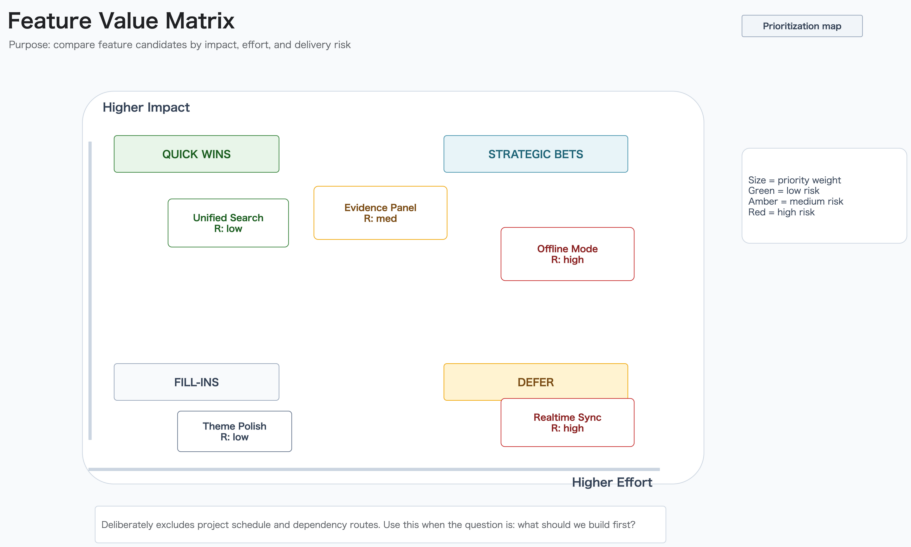
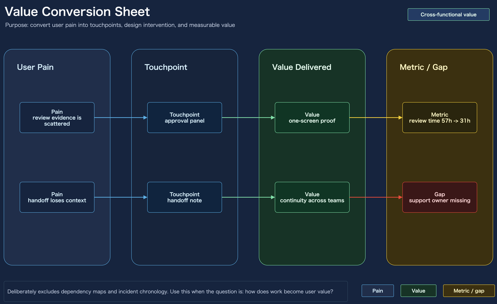

# ショーケース

`draw-io-skill` には、用途の違うサンプル図をいくつか同梱しています。リポジトリ説明用、lint 確認用、見せ方を強めたアイコン付きレイアウト用を分けて持っているので、内向きの作業図ではなくショーケース寄りに見せたいときの土台として使えます。

## リポジトリ構成の全体図


リポジトリのまとまりや、主要な workflow surface のつながりを説明したいときに使うサンプルです。

- `assets/draw-io-skill-structure.drawio`
- `assets/draw-io-skill-structure.drawio.png`
- `assets/draw-io-skill-structure.drawio.svg`
- `assets/draw-io-skill-structure.ja.drawio`
- `assets/draw-io-skill-structure.ja.drawio.png`
- `assets/draw-io-skill-structure.ja.drawio.svg`

## lint 確認用サンプル


SVG export 後に、線の混み具合、文字の収まり、非矩形 shape の周辺を重点的に確認したいときに使うサンプルです。

- `document` / `hexagon` / `parallelogram` / `trapezoid` の文字配置を目視しやすい
- 矢印と shape、外枠と shape の接触を lint 後に見直しやすい
- `fixtures/shape-border-overlap` と `fixtures/shape-text-overflow` の回帰確認と組み合わせやすい

アセット:

- `assets/draw-io-skill-structure-shapes.drawio`
- `assets/draw-io-skill-structure-shapes.drawio.png`
- `assets/draw-io-skill-structure-shapes.drawio.svg`

## アイコン付きブロック例


同じ流れを、各ブロックに役割アイコンを持たせた見せ方へ作り替えたサンプルです。編集可能な `.drawio` を保ったまま、資料や README で見栄えを上げたいときのたたき台として使えます。

- `assets/draw-io-skill-structure-icons.drawio`
- `assets/draw-io-skill-structure-icons.drawio.png`
- `assets/draw-io-skill-structure-icons.drawio.svg`
- `assets/draw-io-skill-structure-icons.ja.drawio`
- `assets/draw-io-skill-structure-icons.ja.drawio.png`
- `assets/draw-io-skill-structure-icons.ja.drawio.svg`

## aesthetic テンプレートサンプル

単発の作業図ではなく、最初から見せる品質で作りたいときの標準サンプルです。

### Polished Technical Template


- `assets/aesthetic-template-sample.drawio`
- `assets/aesthetic-template-sample.drawio.png`
- `assets/aesthetic-template-sample.drawio.svg`

### Executive Dashboard


- `assets/aesthetic-sample-executive-dashboard.drawio`
- `assets/aesthetic-sample-executive-dashboard.drawio.png`
- `assets/aesthetic-sample-executive-dashboard.drawio.svg`

### AI Pipeline



- `assets/aesthetic-sample-ai-pipeline.drawio`
- `assets/aesthetic-sample-ai-pipeline.drawio.png`
- `assets/aesthetic-sample-ai-pipeline.drawio.svg`

### Security Incident


- `assets/aesthetic-sample-security-incident.drawio`
- `assets/aesthetic-sample-security-incident.drawio.png`
- `assets/aesthetic-sample-security-incident.drawio.svg`

## 用途別テンプレート

このセクションのテンプレートは、色違いではなく「何を判断・説明するための図か」を分けています。

### Board Brief


使う問い: 何を、どの前提で、誰が判断するのか。

- 読ませるもの: 目的、現状シグナル、リスク、次アクション、担当
- 除外するもの: 実装手順、詳細ログ、依存関係マップ
- `assets/purpose-board-brief-template.drawio`
- `assets/purpose-board-brief-template.drawio.png`
- `assets/purpose-board-brief-template.drawio.svg`

### Dependency Orbit Map



使う問い: 中心オブジェクトに何が依存していて、影響境界はどこまでか。

- 読ませるもの: コア、直接依存、間接シグナル、外部接続
- 除外するもの: 時系列、日報、工数計画
- `assets/purpose-dependency-orbit-template.drawio`
- `assets/purpose-dependency-orbit-template.drawio.png`
- `assets/purpose-dependency-orbit-template.drawio.svg`

### Incident Timeline


使う問い: 何が観測され、何に影響し、どう対応したのか。

- 読ませるもの: 時刻、観測事実、影響、対応、証拠 ID
- 除外するもの: 推測、未検証の原因、構成図だけの説明
- `assets/purpose-incident-timeline-template.drawio`
- `assets/purpose-incident-timeline-template.drawio.png`
- `assets/purpose-incident-timeline-template.drawio.svg`

### Hypothesis Helix


使う問い: 次に何を検証すべきか。

- 読ませるもの: 仮説、実験、証拠、Go/No-Go 判断、反復
- 除外するもの: 実装アーキテクチャ、カレンダー計画
- `assets/purpose-hypothesis-helix-template.drawio`
- `assets/purpose-hypothesis-helix-template.drawio.png`
- `assets/purpose-hypothesis-helix-template.drawio.svg`

### Feature Value Matrix



使う問い: どの機能から作るべきか。

- 読ませるもの: impact、effort、delivery risk、priority weight
- 除外するもの: project schedule、dependency route
- `assets/purpose-feature-value-matrix-template.drawio`
- `assets/purpose-feature-value-matrix-template.drawio.png`
- `assets/purpose-feature-value-matrix-template.drawio.svg`

### Value Conversion Sheet



使う問い: 作業はどうユーザー価値へ変換されるのか。

- 読ませるもの: user pain、touchpoint、value delivered、metric、gap
- 除外するもの: dependency map、incident chronology
- `assets/purpose-value-conversion-sheet-template.drawio`
- `assets/purpose-value-conversion-sheet-template.drawio.png`
- `assets/purpose-value-conversion-sheet-template.drawio.svg`

## AWS 構成図へ広げるときの土台

このリポジトリには、固定の AWS 構成図を 1 枚だけ置いているわけではありませんが、AWS 図へ広げやすい材料はそろっています。

- `references/aws-icons.md`
- `scripts/find_aws_icon.py`
- `assets/draw-io-skill-structure-icons.drawio*`

ショーケース寄りの AWS 構成図を作りたいときは、まずブロックアイコン例を土台にして、各ブロックを `Route 53` と `CloudFront`、`API Gateway` と `Lambda`、`S3` と `DynamoDB` のようなサービス群へ置き換えるのがおすすめです。書き出しと lint の流れは [Export と lint](./export-and-lint.md) をそのまま使えます。

### 外部例のリンク

編集用ソースと公開用 SVG がそろっている外部リポジトリの実例として、`onizuka-game-agi-co` の次の組み合わせも参照できます。

- [`onizuka-game-agi-aws-architecture.drawio`](https://github.com/onizuka-agi-co/onizuka-game-agi-co/blob/main/docs/onizuka-game-agi-aws-architecture.drawio)
- [`onizuka-game-agi-aws-architecture.drawio.svg`](https://github.com/onizuka-agi-co/onizuka-game-agi-co/blob/main/docs/onizuka-game-agi-aws-architecture.drawio.svg)

ローカル同梱サンプルと見比べながら、実運用寄りの AWS 構成図が `.drawio` と `.svg` でどう並ぶかを確認したいときの参考になります。

### 短い prompt

```text
AWS reference-style icon view のテイストで native draw.io 図を作って。ライトテーマ、濃紺タイトルバー、シアンのアクセント、白いカード、公式 AWS アイコン、Noto Sans JP、orthogonal routing、そして AWS は local/GitHub/workflow を見せるための視覚比喩だと注記を入れて。
```
