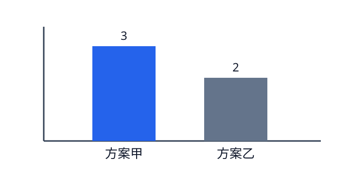

# 问题重述

设决策变量为 $x_1,x_2\geq 0$，目标是在预算约束下最大化收益。本文只验证排版链路，不改变任何学术表述。

::: assumption
单位收益和资源消耗在测试周期内保持不变。
:::

# 模型建立

目标函数与约束写为

$$
\max\ z=3x_1+2x_2,\qquad 2x_1+x_2\leq 10.
$$

表 1 给出测试参数。

| 方案 | 单位收益 | 单位资源 |
|:----:|---------:|---------:|
| 甲   | 3        | 2        |
| 乙   | 2        | 1        |

Table: 测试参数表

{width=55%}

# 结果分析

在边界点比较目标函数可得到测试解。该结论仅用于编译与内容恢复检查。

# 参考文献

[1] 全国大学生数学建模竞赛组委会. 论文格式规范, 2026.
