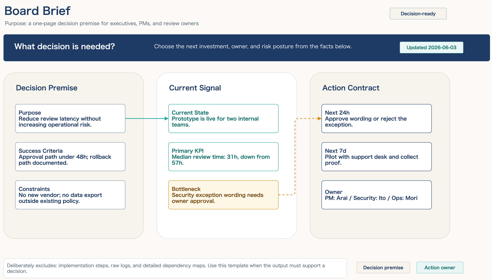
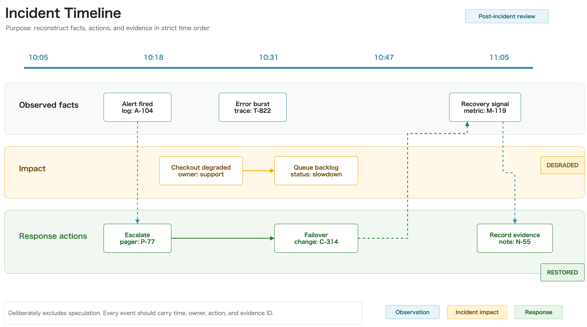
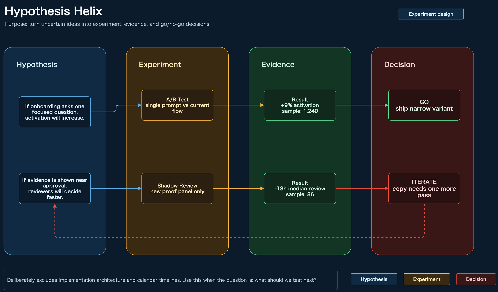
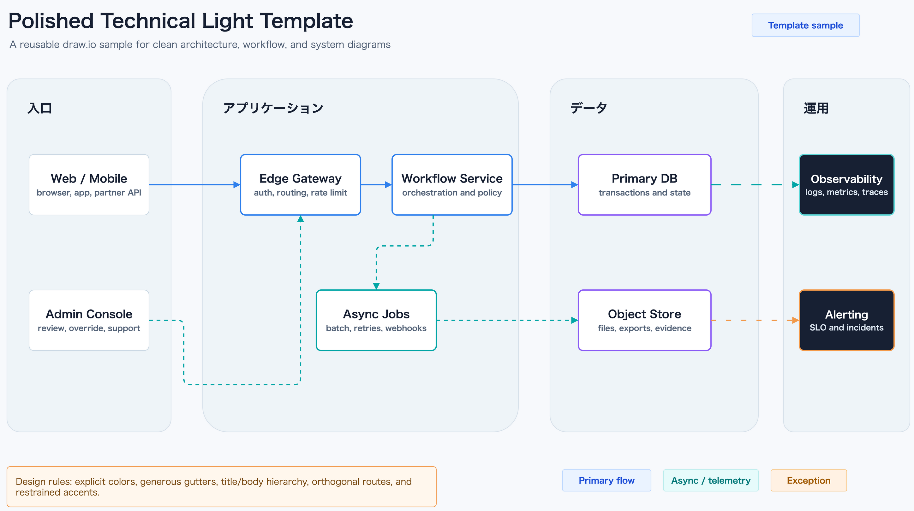
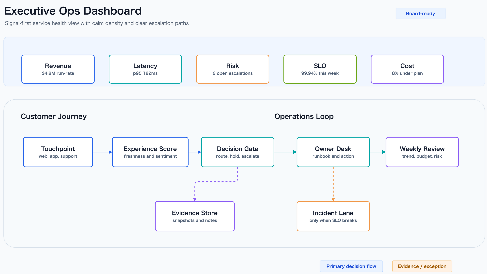
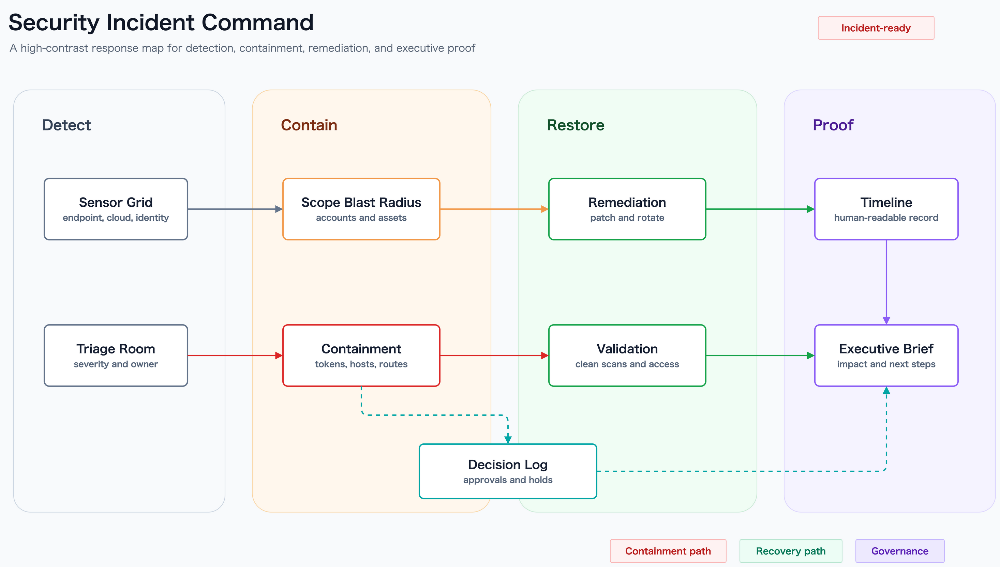

<p align="center">
  
</p>

<h1 align="center">draw-io-skill</h1>

<p align="center">
  <a href="./README.md">English</a> · <strong>日本語</strong>
</p>

<p align="center">
  <a href="https://sunwood-ai-labs.github.io/draw-io-skill/ja/"></a>
  <a href="https://github.com/Sunwood-ai-labs/draw-io-skill/actions/workflows/ci.yml"></a>
  <a href="./LICENSE"></a>
  
  
</p>

<p align="center">
  Codex、Claude Code、リポジトリ運用でそのまま使える、native <code>.drawio</code> 中心の draw.io スキルです。
</p>

## ✨ 概要

`draw-io-skill` は、diagram 作成の実務で必要になりやすい 3 つを 1 つにまとめたリポジトリです。

- native `.drawio` を直接編集するワークフロー
- `png` / `svg` / `pdf` / `jpg` への export helper
- 線の交差、枠線重なり、非矩形 shape の枠線重なり、箱貫通、低コントラスト文字、暗色カード内の弱い文字階層、文字はみ出しを検知する SVG lint

作る、整える、書き出す、崩れを見つける、までをリポジトリの中で一続きに扱えるようにしています。

## 🚀 クイックスタート

まずは同梱 fixture を使ってローカル確認できます。

```bash
npm ci
npm run verify
node scripts/export-drawio.mjs fixtures/basic/basic.drawio --format svg
node scripts/check-drawio-svg-overlaps.mjs fixtures/basic/basic.drawio.svg
uv run python scripts/find_aws_icon.py lambda
```

`npm run verify` は、構文チェック、同梱されている lint 回帰 fixture 一式、docs build までまとめて実行します。`edge-terminal`、`edge-label`、`label-rect`、`text-contrast`、`text-emphasis`、`text-overflow` まで含めて一気に確認したいときの最短ルートです。

ドキュメントサイトだけを build したい場合:

```bash
npm ci
npm run docs:build
```

## 🧭 基本フロー

1. native `.drawio` を作成または更新する
2. `.drawio` を編集用ソースとして残す
3. `png` / `svg` / `pdf` が必要なら埋め込み XML 付きで export する
4. 線のルーティングやラベル密度が高い図では SVG lint を走らせる
5. 公開前に最後は目視で確認する

<p align="center">
  
</p>

日本語向けの編集用ソースと書き出し済みアセットは
`assets/draw-io-skill-structure.ja.drawio`、
`assets/draw-io-skill-structure.ja.drawio.png`、
`assets/draw-io-skill-structure.ja.drawio.svg`
にあります。英語版は従来どおり `assets/draw-io-skill-structure.drawio` 系を参照してください。

## 🖼️ ショーケース用サンプル

ショーケース寄りに見せたいときは、次の同梱サンプルを起点にするのがおすすめです。

- `assets/draw-io-skill-structure.drawio*` はリポジトリ構成の導入向け
- `assets/draw-io-skill-structure-shapes.drawio*` は非矩形 shape を含む lint / 目視確認向け
- `assets/draw-io-skill-structure-icons.drawio*` は AWS アイコンガイドや `uv run python scripts/find_aws_icon.py` と相性のよい、見せ方重視のアイコン付きブロック例
- `assets/aesthetic-template-sample.drawio*` は標準の polished technical template
- `assets/aesthetic-sample-executive-dashboard.drawio*` は経営・意思決定向け KPI 表現
- `assets/aesthetic-sample-ai-pipeline.drawio*` は AI workflow / model pipeline の説明向け
- `assets/aesthetic-sample-security-incident.drawio*` は security response の説明向け
- `assets/purpose-board-brief-template.drawio*` は 1 枚で意思決定前提を共有する brief 向け
- `assets/purpose-dependency-orbit-template.drawio*` は dependency radius と影響境界を見せる用途向け
- `assets/purpose-incident-timeline-template.drawio*` は観測事実・影響・対応を時系列で再構成する用途向け
- `assets/purpose-hypothesis-helix-template.drawio*` は仮説を実験・証拠・判断へ変換する用途向け
- `assets/purpose-feature-value-matrix-template.drawio*` は impact / effort / risk で機能候補を優先順位付けする用途向け
- `assets/purpose-value-conversion-sheet-template.drawio*` は user pain を touchpoint / value / metric へ変換する用途向け

### 用途別テンプレートギャラリー

これらは色違いではなく、存在意義を分けたテンプレートです。

| テンプレート | 目的 | 除外するもの |
| --- | --- | --- |
| Board Brief | 意思決定前提を 1 枚で共有する | 実装手順、依存関係マップ |
| Dependency Orbit Map | 直接・間接依存の半径と影響境界を示す | 時系列、進捗報告 |
| Incident Timeline | 観測事実、影響、対応を時系列で再構成する | 推測原因、構成図 |
| Hypothesis Helix | 不確かな案を実験、証拠、Go/No-Go 判断に変換する | 実装アーキテクチャ、カレンダー計画 |
| Feature Value Matrix | 機能候補を impact / effort / risk で優先順位付けする | delivery schedule、dependency route |
| Value Conversion Sheet | user pain を touchpoint、介入、測定可能な価値に変換する | dependency map、incident chronology |







### aesthetic サンプルギャラリー






### 外部例のリンク

外部公開されている AWS 構成図の実例として、`onizuka-game-agi-co` の次の 2 ファイルも参照できます。

- [`onizuka-game-agi-aws-architecture.drawio`](https://github.com/onizuka-agi-co/onizuka-game-agi-co/blob/main/docs/onizuka-game-agi-aws-architecture.drawio) は編集用ソース
- [`onizuka-game-agi-aws-architecture.drawio.svg`](https://github.com/onizuka-agi-co/onizuka-game-agi-co/blob/main/docs/onizuka-game-agi-aws-architecture.drawio.svg) は docs 掲載向けの SVG 例

### 短い prompt

```text
AWS reference-style icon view のテイストで native draw.io 図を作って。ライトテーマ、濃紺タイトルバー、シアンのアクセント、白いカード、公式 AWS アイコン、Noto Sans JP、orthogonal routing、そして AWS は local/GitHub/workflow を見せるための視覚比喩だと注記を入れて。
```

ガイド付きの紹介は [`docs/ja/guide/showcase.md`](./docs/ja/guide/showcase.md) にまとめています。

## 🛠️ 含まれるもの

### native draw.io ワークフロー

- `mxGraphModel` XML を直接扱える
- `.drawio.<format>` 命名を統一できる
- 対応形式では埋め込み XML 付き export を使える

### export helper

```bash
node scripts/export-drawio.mjs architecture.drawio --format png --open
node scripts/export-drawio.mjs architecture.drawio --format svg
node scripts/export-drawio.mjs architecture.drawio --output architecture.drawio.pdf
```

Windows / macOS / Linux の draw.io CLI 検出、PNG の透明背景 2x export、必要時のみの `--delete-source` に対応しています。

### SVG lint

```bash
node scripts/check-drawio-svg-overlaps.mjs fixtures/basic/basic.drawio.svg
node scripts/check-drawio-svg-overlaps.mjs fixtures/border-overlap/border-overlap.drawio.svg
node scripts/check-drawio-svg-overlaps.mjs fixtures/large-frame-border-overlap/large-frame-border-overlap.drawio.svg
node scripts/check-drawio-svg-overlaps.mjs fixtures/shape-border-overlap/shape-border-overlap.drawio.svg
node scripts/check-drawio-svg-overlaps.mjs fixtures/label-rect-overlap/label-rect-overlap.drawio
node scripts/check-drawio-svg-overlaps.mjs fixtures/text-cell-overflow/text-cell-overflow.drawio
node scripts/check-drawio-svg-overlaps.mjs fixtures/text-contrast/text-contrast.drawio
node scripts/check-drawio-svg-overlaps.mjs fixtures/text-emphasis/text-emphasis.drawio
```

検知対象:

- `edge-edge`
- `edge-rect-border` 箱や大きいフレームの枠線に沿う、または重なる線
- `edge-shape-border` `document` / `hexagon` / `parallelogram` / `trapezoid` など、対応する非矩形 shape の枠線に沿う、または重なる線
- `edge-rect`
- `edge-terminal` 最後の曲がり角から矢印先端までの直線が短すぎるケース
- `edge-label` 配線がラベル文字の領域を突っ切るケース
- `label-rect` ラベル文字の領域に別の箱やカードが食い込むケース
- `rect-shape-border` 箱やフレームの枠線が、対応する非矩形 shape の枠線に沿う、または重なるケース
- `text-contrast` 明示された文字色と背景色の差が小さすぎるケース
- `text-emphasis` 暗色のコンパクトなカードで、見出しと本文が 1 つの密な塊に潰れて見えるケース
- `text-overflow(width)`
- `text-overflow(height)`

checker は `.drawio` と `.drawio.svg` の両方を受け付けます。`.drawio` を直接渡した場合は companion の draw.io geometry も使うので、`label-rect` や文字フィット判定が編集ソースと揃いやすくなります。

リポジトリには、通常の箱枠重なり用 `fixtures/border-overlap/...`、大きいセクション枠用 `fixtures/large-frame-border-overlap/...`、非矩形 shape 枠線用 `fixtures/shape-border-overlap/...`、label-box 重なり用 `fixtures/label-rect-overlap/...`、text cell の文字はみ出し用 `fixtures/text-cell-overflow/...`、低コントラスト文字用 `fixtures/text-contrast/...`、暗色カードの文字階層用 `fixtures/text-emphasis/...`、shape-aware な文字はみ出し用 `fixtures/shape-text-overflow/...` の回帰 fixture が含まれています。CI で配線崩れを拾いたいときに使えます。`edge-terminal`、`edge-label`、`label-rect`、`text-emphasis` は、export 後に起きやすい「矢印先端のちょい線」「ラベル文字の突っ切り」「注釈 box がラベルにかぶさる」「暗色カードで見出しと本文が溶ける」を拾うための追加ヒューリスティクスです。

リポジトリ内で lint や目視確認のサンプルとして使う場合は
`assets/draw-io-skill-structure-shapes.drawio`、
`assets/draw-io-skill-structure-shapes.drawio.png`、
`assets/draw-io-skill-structure-shapes.drawio.svg`
を参照してください。

見せ方を強めた資料向けサンプルとしては
`assets/draw-io-skill-structure-icons.drawio`、
`assets/draw-io-skill-structure-icons.drawio.png`、
`assets/draw-io-skill-structure-icons.drawio.svg`
も利用できます。

`text-contrast` が出たら、背景と文字の実コントラストを上げます。質感やノイズで誤魔化さず、まず色差を広げます。

`text-emphasis` が出たら、見出し chip を分ける、本文を別 text cell にする、余白を増やす、などで階層を強めるのがおすすめです。

## 📦 インストール

### Codex

```powershell
git clone https://github.com/Sunwood-ai-labs/draw-io-skill.git D:\Prj\draw-io-skill
cmd /c mklink /J C:\Users\YOUR_NAME\.codex\skills\lab-ultra-draw-io D:\Prj\draw-io-skill
```

### Claude Code

```bash
git clone https://github.com/Sunwood-ai-labs/draw-io-skill.git ~/.claude/skills/drawio
```

## 📚 ドキュメント

- [GitHub Pages ドキュメント](https://sunwood-ai-labs.github.io/draw-io-skill/ja/)
- [はじめに](./docs/ja/guide/getting-started.md)
- [ショーケース](./docs/ja/guide/showcase.md)
- [ワークフローガイド](./docs/ja/guide/workflow.md)
- [アーキテクチャガイド](./docs/ja/guide/architecture.md)
- [Export と lint](./docs/ja/guide/export-and-lint.md)
- [Reference ガイド](./docs/ja/guide/reference-guides.md)
- [トラブルシューティング](./docs/ja/guide/troubleshooting.md)
- [レイアウトガイドライン](./references/layout-guidelines.md)
- [AWS アイコンガイド](./references/aws-icons.md)
- [エージェント向けスキル本文](./SKILL.md)

## 🗂️ リポジトリ構成

```text
draw-io-skill/
├── README.md
├── README.ja.md
├── SKILL.md
├── LICENSE
├── assets/
│   ├── aesthetic-sample-ai-pipeline.drawio
│   ├── aesthetic-sample-ai-pipeline.drawio.png
│   ├── aesthetic-sample-ai-pipeline.drawio.svg
│   ├── aesthetic-sample-executive-dashboard.drawio
│   ├── aesthetic-sample-executive-dashboard.drawio.png
│   ├── aesthetic-sample-executive-dashboard.drawio.svg
│   ├── aesthetic-sample-security-incident.drawio
│   ├── aesthetic-sample-security-incident.drawio.png
│   ├── aesthetic-sample-security-incident.drawio.svg
│   ├── aesthetic-template-sample.drawio
│   ├── aesthetic-template-sample.drawio.png
│   ├── aesthetic-template-sample.drawio.svg
│   ├── draw-io-skill-hero.svg
│   ├── draw-io-skill-icon.svg
│   ├── draw-io-skill-penpen-header.webp
│   ├── draw-io-skill-structure.drawio
│   ├── draw-io-skill-structure.drawio.png
│   ├── draw-io-skill-structure.drawio.svg
│   ├── draw-io-skill-structure-icons.drawio
│   ├── draw-io-skill-structure-icons.drawio.png
│   ├── draw-io-skill-structure-icons.drawio.svg
│   ├── draw-io-skill-structure-icons.ja.drawio
│   ├── draw-io-skill-structure-icons.ja.drawio.png
│   ├── draw-io-skill-structure-icons.ja.drawio.svg
│   ├── draw-io-skill-structure-shapes.drawio
│   ├── draw-io-skill-structure-shapes.drawio.png
│   ├── draw-io-skill-structure-shapes.drawio.svg
│   ├── draw-io-skill-structure.ja.drawio
│   ├── draw-io-skill-structure.ja.drawio.png
│   ├── draw-io-skill-structure.ja.drawio.svg
│   ├── purpose-board-brief-template.drawio
│   ├── purpose-board-brief-template.drawio.png
│   ├── purpose-board-brief-template.drawio.svg
│   ├── purpose-dependency-orbit-template.drawio
│   ├── purpose-dependency-orbit-template.drawio.png
│   ├── purpose-dependency-orbit-template.drawio.svg
│   ├── purpose-feature-value-matrix-template.drawio
│   ├── purpose-feature-value-matrix-template.drawio.png
│   ├── purpose-feature-value-matrix-template.drawio.svg
│   ├── purpose-hypothesis-helix-template.drawio
│   ├── purpose-hypothesis-helix-template.drawio.png
│   ├── purpose-hypothesis-helix-template.drawio.svg
│   ├── purpose-incident-timeline-template.drawio
│   ├── purpose-incident-timeline-template.drawio.png
│   ├── purpose-incident-timeline-template.drawio.svg
│   ├── purpose-value-conversion-sheet-template.drawio
│   ├── purpose-value-conversion-sheet-template.drawio.png
│   └── purpose-value-conversion-sheet-template.drawio.svg
├── docs/
│   ├── .vitepress/
│   ├── guide/
│   ├── ja/
│   └── public/
├── fixtures/
│   ├── basic/
│   ├── border-overlap/
│   ├── label-rect-overlap/
│   ├── large-frame-border-overlap/
│   ├── shape-border-overlap/
│   ├── shape-text-overflow/
│   └── text-cell-overflow/
├── references/
│   ├── aws-icons.en.md
│   ├── aws-icons.md
│   ├── layout-guidelines.en.md
│   └── layout-guidelines.md
└── scripts/
    ├── check-drawio-svg-overlaps.mjs
    ├── convert-drawio-to-png.sh
    ├── export-drawio.mjs
    ├── find_aws_icon.py
    ├── verify-border-overlap-fixture.mjs
    ├── verify-label-rect-fixture.mjs
    └── verify-text-cell-overflow-fixture.mjs
```

## 🙏 参考元とクレジット

このリポジトリは、次の強みを組み合わせています。

- `softaworks/agent-toolkit` のレイアウト・編集指針
- `jgraph/drawio-mcp` の native draw.io ワークフロー
- このリポジトリで追加した lint / export / 公開向け整備

参考にしたソース:

- [softaworks/agent-toolkit - skills/lab-ultra-draw-io/README.md](https://github.com/softaworks/agent-toolkit/blob/main/skills/draw-io/README.md)
- [jgraph/drawio-mcp - skill-cli/README.md](https://github.com/jgraph/drawio-mcp/blob/main/skill-cli/README.md)
- [jgraph/drawio-mcp - skill-cli/drawio/SKILL.md](https://github.com/jgraph/drawio-mcp/blob/main/skill-cli/drawio/SKILL.md)
- [draw.io Style Reference](https://www.drawio.com/doc/faq/drawio-style-reference.html)
- [draw.io mxfile XSD](https://www.drawio.com/assets/mxfile.xsd)

## 📄 ライセンス

[MIT](./LICENSE)
